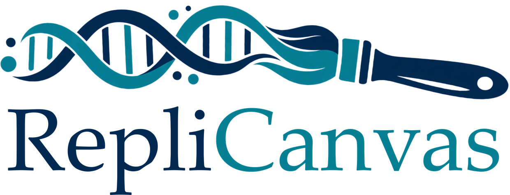

<p align="center">
  
</p>

<p align="center"><strong>Make beautiful figures and videos of DNA replication.</strong></p>

<p align="center">
  <a href="https://fberkemeier.github.io/RepliCanvas/"><strong>Launch RepliCanvas →</strong></a>
</p>

RepliCanvas is a lightweight browser studio for creating publication-ready DNA replication diagrams and animations. Place origins, shape bubbles and forks, customise the molecule, and export a figure or a complete S-phase animation without a build step.

## Features

- **Three geometries.** Use linear DNA, periodic circular DNA, or paint arbitrary free-form molecules on an independent canvas.
- **Free-form editing.** Free form opens as a blank workspace with the Paint brush selected and its genomic scale hidden. Paint smoothly interpolated DNA paths, snap new or reshaped ends to highlighted connection points, close a stroke back onto its first point to create a periodic loop, erase sections to split a molecule, and keep several independent pieces on one canvas. Snapped pieces remain independent replication segments, and each piece retains its own shape, base-pair pattern, origins, forks and replication state when unrelated DNA is added or removed; the total genomic-length control updates automatically without refitting the canvas.
- **Interactive replication.** Add origins, drag bubbles or individual forks, split replicated regions, create strand breaks, and selectively reverse replication. Circular and closed free-form molecules wrap continuously through their genomic seam, including smooth strand geometry as forks cross genomic zero.
- **Flexible molecular styling.** Choose Standard, Straight or Minimal representations; tune base-pair resolution, strand dimensions, spacing, handedness, crossover behaviour, fork transitions, contours and colour schemes. Two-colour base pairs support depth-aware separation and constrained angular tilt.
- **Animation and export.** Run S phase continuously or base pair by base pair while preserving origin firing schedules. Export tightly cropped PNG, SVG and PDF files, or generate an MP4 with configurable frame rate, resolution and quality. MP4 generation shows determinate progress and downloads automatically when complete; it remains disabled until at least one origin is present.
- **Responsive at scale.** Adaptive path sampling, cached free-form arc-length metrics and interaction-time detail reduction keep large genomes and complex drawings responsive while retaining full export detail.
- **Reusable projects.** Save and reload complete configurations, including free-form topology and component-specific replication edits, with optional browser persistence.

The canvas toolbar appears vertically in the lower-left corner in **Free form** geometry. Use **DNA tools** for origins and forks, **Shape** to reshape a path, **Paint** to add a piece, and **Erase** to remove or split DNA. Open ends are always marked as connectable targets during Paint and Shape editing, and both ends of a stroke remain visible while it is being painted. Snapping to another piece creates a smooth visual link while preserving independent replication; the loop option controls only whether a stroke can snap back to its own first point and become periodic. Erase shows an adjacent size slider and a painted footprint that matches the area being removed; the remaining controls close or reopen the selected loop and delete the selected piece.

## Run locally

From the repository root:

```bash
python -m http.server 8000
```

Then open `http://localhost:8000/` in a modern Chromium-based browser.

## Development

Run the regression suite with:

```bash
node --test tests/replicanvas.logic.test.cjs
```

## Citation

Please cite RepliCanvas using the metadata in [`CITATION.cff`](CITATION.cff).

## Issues

Bug reports, suggestions and scientific feature requests are welcome through the [GitHub issue tracker](https://github.com/fberkemeier/RepliCanvas/issues).

**Francisco Berkemeier**  
[fp409@cam.ac.uk](mailto:fp409@cam.ac.uk) · [github.com/fberkemeier](https://github.com/fberkemeier)

## License

RepliCanvas is released under the [MIT License](LICENSE). The bundled Mediabunny library is distributed under the [Mozilla Public License 2.0](assets/vendor/MEDIABUNNY-LICENSE.txt).
