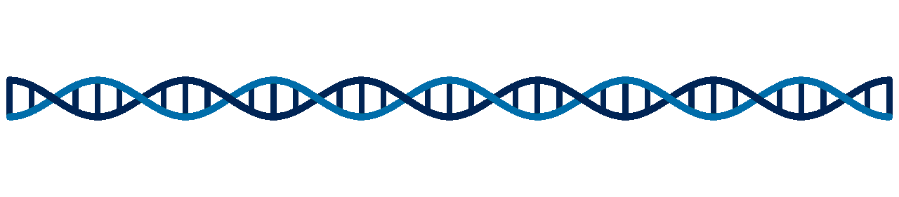
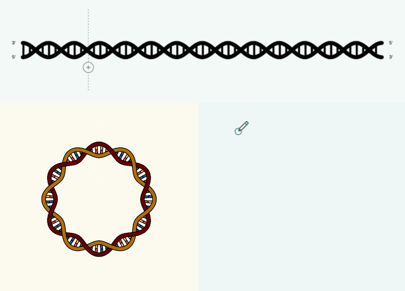

  

<strong>Make beautiful figures and videos of DNA replication.</strong>

  <a href="https://fberkemeier.github.io/RepliCanvas/"><strong>Launch RepliCanvas</strong></a>

RepliCanvas is a free, browser-based studio for drawing, exploring, and animating DNA replication. Shape origins, bubbles, and forks directly on the canvas, customise their molecular presentation, and export publication-ready figures or complete S-phase animations. No installation is required to use the live app.

  

<em>DNA replication in a two-origin system.</em>

## Create a replication figure or animation

1. **Choose a molecule.** Start with linear or circular DNA, or paint an arbitrary free-form path.
2. **Build and style the model.** Add origins, move bubbles and individual forks, then adjust strands, base pairs, colours, labels, geometry, and replication timing.
3. **Animate or export.** Run the S phase, save the configuration for later, or download the result as a figure, GIF, or video.

## What RepliCanvas can do

- **Edit replication directly.** Add origins, drag forks and bubbles, split replicated regions, create strand breaks, and step through replication continuously or one base pair at a time.
- **Support several visual languages.** Switch between Standard, Straight, and Minimal representations and tune spacing, dimensions, handedness, transitions, contours, colours, and layers.
- **Draw free-form DNA.** Paint smooth open or periodic molecules, connect paths, reshape them, erase sections, and keep several independent DNA pieces on the same canvas.
- **Save reusable projects.** Download a complete configuration and load it later to continue editing every relevant parameter and replication event.

  <picture>
    <source media="(prefers-color-scheme: dark)" srcset="assets/img/replicanvas-modes-demo-dark.gif" />
    <source media="(prefers-color-scheme: light)" srcset="assets/img/replicanvas-modes-demo.gif" />
    
  </picture>

<em>Three ways to shape a replicating molecule: linear, circular, or entirely free-form.</em>

## Export

| Format | Best for |
| --- | --- |
| **PNG** | High-resolution raster figures |
| **SVG** | Editable vector artwork |
| **PDF** | Print-ready figures |
| **GIF** | Lightweight, easily shared animations |
| **MP4** | High-quality S-phase videos |

GIF and MP4 frame rate and dimensions are configured independently under **Settings**. GIF also offers palette and looping controls; MP4 offers video-quality controls. A current Chromium-based browser is recommended for the most reliable animation export.

## Citation

If RepliCanvas supports your work, please cite the software using the metadata in [`CITATION.cff`](CITATION.cff). GitHub also exposes this through **Cite this repository**.

## Issues and contact

Bug reports, feature ideas, and scientific suggestions are welcome through the [GitHub issue tracker](https://github.com/fberkemeier/RepliCanvas/issues).

**Francisco Berkemeier**  
[fp409@cam.ac.uk](mailto:fp409@cam.ac.uk) · [github.com/fberkemeier](https://github.com/fberkemeier)

## License

RepliCanvas is released under the [MIT License](LICENSE). The bundled Mediabunny library is distributed under the [Mozilla Public License 2.0](assets/vendor/MEDIABUNNY-LICENSE.txt).
